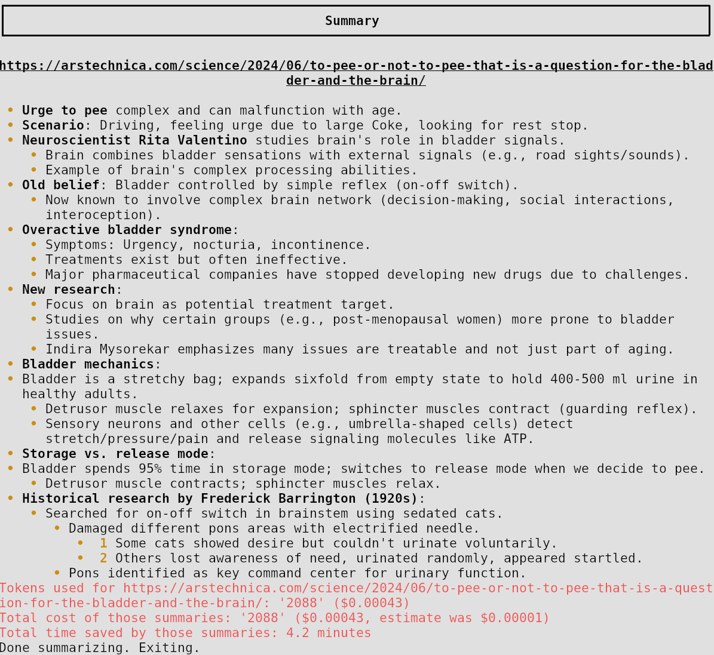

    

# WDoc

* **Goal and project specifications** use [LangChain](https://python.langchain.com/) to summarize, search or query documents. I'm a medical student so I need to be able to query from **tens of thousands** of documents, of different types ([Supported filetypes](#Supported-filetypes)). I also have little free time so I needed a tailor made summary feature to keep up with the news.
* **Current status**: **still under development**.
    * I use it almost daily and have been for months now.
    * Expect some breakage but they can be fixed usually in a few minutes if you open an issue here.
    * The main branch is usually fine but the dev branch has more features.
    * I accept feature requests and pull requests.
    * Issues are extremely appreciated for any reason including typos etc.
    * Prefer asking me before making a PR because I have many improvements in the pipeline but do this on my spare time. Do tell me if you have specific needs!

### Table of contents
- [What is WDoc in a few questions](#wdoc-in-a-few-questions)
- [Features](#features)
  - [Planned Features](#planned-features)
  - [Supported filetypes](#supported-filetypes)
  - [Supported tasks](#supported-tasks)
  - [Walkthrough and examples](#walkthrough-and-examples)
- [Getting started](#getting-started)
- [Notes](#notes)
  - [Known issues](#known-issues)

## WDoc in a few questions
* **Who is this for?**
    * WDoc is for power users who want document querying on steroid, and in depth AI powered document summaries.
* **What's RAG?**
    * A RAG system (retrieval augmented generation) is basically an LLM powered search through a text corpus.
* **Why make another RAG system? Can't you use any of the others?**
    * I'm a medical student so I need to be able to ask medical question from **a lot** (tens of thousands) of documents, of different types (epub, pdf, [anki](https://ankitects.github.io/) database, [Logseq](https://github.com/logseq/logseq/), website dump, youtube videos and playlists, recorded conferences, audio files, etc).
* **Why is WDoc better than most RAG system to ask questions on documents?**
    * It uses both a strong and query_eval LLM. After finding the appropriate documents using embeddings, the query_eval LLM is used to filter through the documents that don't seem to be about the question, then the strong LLM answers the question based on each remaining documents, then combines them all in a neat markdown. Also WDoc is very customizable.
* **Why can WDoc also produce summaries?**
    * I have little free time so I needed a tailor made summary feature to keep up with the news. But most summary systems are rubbish and just try to give you the high level takeaway points, and don't handle properly text chunking. So I made my own tailor made summarizer. **The summary prompts can be found in `utils/prompts.py` and focus on extracting the arguments/reasonning/though process/arguments of the author then use markdown indented bullet points to make it easy to read.** It's really good! The prompts dataclass is not frozen so you can provide your own prompt if you want.
* **What other tasks are supported by WDoc?**
    * Summarize text from any [Supported filetypes](#Supported-filetypes).
    * Ask questions about a large heterogeneous corpus.
    * Search the relevant documents using embeddings.
    * Search the relevant documents using embeddings then filtering using a cheap LLM.
* **Which LLM providers are supported by WDoc?**
    * WDoc supports virtually any LLM provider thanks to [litellm](https://docs.litellm.ai/). It even supports local LLM and local embeddings (see [Walkthrough and examples](#Walkthrough-and-examples) section).
* **What do you use WDoc for?**
    * I follow heterogeneous sources to keep up with the news: youtube, website, etc. So thanks to WDoc I can automatically create awesome markdown summaries that end up straight into my [Logseq](https://github.com/logseq/logseq/) database as a bunch of `TODO` blocks.
    * I use it to ask technical questions to my vast heterogeneous corpus of medical knowledge.
    * I use it to query my personal documents using the `--private` argument.
    * I sometimes use it to summarize a documents then go straight to asking questions about it, all in the same command.
    * I use it to ask questions about entire youtube playlists.
* **What's up with the name?** One of my favorite character (and somewhat of a rolemodel is [Winston Wolf](https://www.youtube.com/watch?v=UeoMuK536C8) and after much hesitation I decided `WolfDoc` would be too confusing and `WinstonDoc` sounds like something micro$oft would do. Also `wd` and `wdoc` were free, whereas `doctools` was already taken. The initial name of the project was `DocToolsLLM`, a play on words between 'doctor' and 'tool'.

## Features
* **Advanced RAG to query lots of diverse documents**:
    1. The documents are retrieved using embedding
    2. Then a weak LLM model ("Evaluator") is used to tell which of those document is not relevant
    3. Then the strong LLM is used to answer ("Answerer") the question using each individual remaining documents.
    4. Then all relevant answers are combined ("Combiner") into a single short markdown-formatted answer.
    Evaluator, Answerer and Combiner are the names given to each LLM in their system prompt, this way you can easily add specific additional instructions to a specific step.
    * Supports a special syntax like "QE >>>> QA" were QE is a question used to filter the embeddings and QA is the actual question you want answered.
* **Advanced summary**:
    * Instead of unusable "high level takeaway" points, compress the reasoning, arguments, though process etc of the author into an easy to skim markdown file.
    * The summaries are then checked again n times for correct logical indentation etc.
    * The summary can be in the same language as the documents or directly translated.
* **Multiple LLM providers**: OpenAI, Mistral, Claude, Ollama, Openrouter, etc. Thanks to [litellm](https://docs.litellm.ai/).
* **Private LLM**: take some measures to make sure no data leaves your computer and goes to an LLM provider: no API keys are used, all `api_base` are user set, cache are isolated from the rest, outgoing connections are censored by overloading sockets, etc.
* **Many tasks**: See [Supported tasks](#Supported-tasks).
* **Many filetypes**: also supports combination to load recursively or define complex heterogenous corpus like a list of files, list of links, using regex, youtube playlists etc. See [Supported filestypes](#Supported-filetypes). All filetype can be seamlessly combined in the same index, meaning you can query your anki collection at the same time as your work PDFs). It supports removing silence from audio files and youtube videos too!
* **Sane embeddings**: By default use sophisticated embeddings like HyDE, parent retriever etc. Customizable.
* **Documented** Lots of docstrings, lots of in code comments, detailed `--help` etc. The full usage can be found in the file [USAGE.md](./WDoc/docs/USAGE.md) or via `python -m WDoc --help`.
* **Lazy imports**: Faster statup time thanks to lazy_import
* **LLM (and embeddings) caching**: speed things up, as well as index storing and loading (handy for large collections).
* **Sophisticated faiss saver**: [faiss](https://github.com/facebookresearch/faiss/wiki) is used to quickly find the documents that match an embedding. But instead of storing as a single file, WDoc splits the index into 1 document long index identified by deterministic hashes. When creating a new index, any overlapping document will be automatically reloaded instead of recomputed.
* **Easy model testing** Include an LLM name matcher that fuzzy finds the most appropriate model given an name.
* **Good PDF parsing** PDF parsers are notoriously unreliable, so 10 (!) different loaders are used, and the best according to a parsing scorer is kept.
* **Markdown formatted answers and summaries**: using [rich](https://github.com/Textualize/rich).
* **Document filtering**: based on regex for document content or metadata.
* **Fast**: Parallel document parsing and embedding.
* **Shell autocompletion** using [python-fire](https://github.com/google/python-fire/blob/master/docs/using-cli.md#completion-flag)
* **Static typed**: Runtime type checking. Opt out with an environment flag: `WDOC_TYPECHECKING="disabled / warn / crash" WDoc` (by default: `warn`). Thanks to [beartype](https://beartype.readthedocs.io/en/latest/) it shouldn't even slow down the code!
* **Scriptable**: You can use WDoc in other python project using `--import_mode`
* **Notification callback**: Can be used for example to get summaries on your phone using [ntfy.sh](ntfy.sh).
* **Fully documented**: I work hard to maintain an exhaustive documentation at `wdoc --help`
* Very customizable, with a friendly dev! Just open an issue if you have a feature request or anything else.

### Planned features
*(These don't include improvements, bugfixes, refactoring etc.)*
* Accept input from stdin, to for example query directly from a manpage
* Much faster startup time
* Much improved retriever:
    * More configurable HyDE.
    * Web search retriever, online information lookup via jina.ai reader and search.
    * LLM powered synonym expansion for embeddings search.
* Investigate switching to Milvus Lite instead of handling split faiss indexes.
* A way to specify at indexing time how trusting you are of a given set of document.
* A way to open the documents automatically, based on the platform used. For ex if okular is installed, open pdfs directly at the appropriate page.
* Improve the scriptability of WDoc. Add examples for how you use it with Logseq.
    * Include a server example, that mimics the OpenAI's API to make your RAG directly accessible to other apps.
    * Add a gradio GUI.
* Include the possible whisper/deepgram extra expenses when counting costs.
* Add support for user defined loaders.
* Add support for custom user prompt.
* Automatically caption document images using an LLM, especially nice for anki cards.

### Supported filetypes
* **auto**: default, guess the filetype for you
* **url**: try many ways to load a webpage, with heuristics to find the better parsed one
* **youtube**: text is then either from the yt subtitles / translation or even better: using whisper / deepgram
* **pdf**: 10 loaders are used, heuristics are used to keep the best one
* **online_pdf**: via URL then treated at **local_pdf**
* **anki**: any subset of an [anki](https://github.com/ankitects/anki) collection db
* **string**: the cli prompts you for a text so you can easily paste something, handy for paywalled articles!
* **text**: .txt, markdown, etc
* **local_html**: useful for website dumps
* **logseq_markdown**: thanks to my other project: [LogseqMarkdownParser](https://github.com/thiswillbeyourgithub/LogseqMarkdownParser) you can use your [Logseq graph](https://github.com/logseq/logseq/)
* **local_audio**: supports many file formats, can use either OpenAI's whisper or [deepgram](https://deepgram.com). Supports automatically removing silence etc.
* **local_video**: extract the audio then treat it as **local_audio**
* **online media**: use youtube_dl to try to download videos/audio, if fails try to intercept good url candidates using playwright to load the page. Then processed as **local_audio** (but works with video too).
* **epub**: barely tested because epub is in general a poorly defined format
* **powerpoint**: .ppt, .pptx, .odp, ...
* **word**: .doc, .docx, .odt, ...

* **Recursive types**
    * **youtube playlists**: get the link for each video then process as **youtube**
    * **recursive_paths**: turns a path, a regex pattern and a filetype into all the files found recurisvely, and treated a the specified filetype (for example many PDFs or lots of HTML files etc).
    * **link_file**: turn a text file where each line contains a url into appropriate loader arguments. Supports any link, so for example webpage, link to pdfs and youtube links can be in the same file. Handy for summarizing lots of things!
    * **json_entries**: turns a path to a file where each line is a json **dict**: that contains arguments to use when loading. Example: load several other recursive types. An example can be found in `docs/json_entries_example.json`.
    * **toml_entries**: read a .toml file. An example can be found in `docs/toml_entries_example.toml`.

### Supported tasks
* **query** give documents and asks questions about it.
* **search** only returns the documents and their metadata. For anki it can be used to directly open cards in the browser.
* **summarize** give documents and read a summary. The summary prompt can be found in `utils/prompts.py`.
* **summarize_then_query** summarize the document then allow you to query directly about it.

## Walkthrough and examples
1. Say you want to ask a question about one pdf, that's simple: `wdoc --task "query" --path "my_file.pdf" --filetype="pdf"`. Note that you could have just let `--filetype="auto"` and it would have worked the same.
2. You have several pdf? Say you want to ask a question about any pdf contained in a folder, that's not much more complicated : `wdoc --task "query" --path "my/other_dir" --pattern "**/*pdf" --filetype "recursive_paths" --recursed_filetype "pdf" --query "My question about those documents"`. So basically you give as path the path to the dir, as pattern the globbing pattern used to find the files relative to the path, set as filetype "recursive_paths" so that WDoc knows what arguments to expect, and specify as recursed_filetype "pdf" so that WDoc knows that each found file must be treated as a pdf. You can use the same idea to glob any kind of file supported by WDoc like markdown etc. You can even use "auto"! Note that you can either directly ask your question with `--query "my question"`, or wait for an interactive prompt to pop up, or just pass the question as *args like so `wdoc [your kwargs] here is my question`.
3. You want more? You can write a `.json` file where each line (`#comments` and empty lines are ignored) will be parsed as a list of argument. For example one line could be : `{"path": "my/other_dir", "pattern": "**/*pdf", "filetype": "recursive_paths", "recursed_filetype": "pdf"}`. This way you can use a single json file to specify easily any number of sources. `.toml` files are also supported.
4. You can specify a "source_tag" metadata to help distinguish between documents you imported.
5. Now say you do this with many many documents, as I do, you of course can't wait for the indexing to finish every time you have a question (even though the embeddings are cached). You should then add `--save_embeds_as=your/saving/path` to save all this index in a file. Then simply do `--load_embeds_from=your/saving/path` to quickly ask queries about it!
6. To know more about each argument supported by each filetype, `wdoc --help`
7. There is a specific recursive filetype I should mention: `--filetype="link_file"`. Basically the file designated by `--path` should contain in each line (`#comments` and empty lines are ignored) one url, that will be parsed by WDoc. I made this so that I can quickly use the "share" button on android from my browser to a text file (so it just appends the url to the file), this file is synced via [syncthing](https://github.com/syncthing/syncthing) to my browser and WDoc automatically summarize them and add them to my [Logseq](https://github.com/logseq/logseq/). Note that the url is parsed in each line, so formatting is ignored, for example it works even in markdown bullet point list.
8. If you want to make sure your data remains private here's an example with ollama: `wdoc --private --llms_api_bases='{"model": "http://localhost:11434", "query_eval_model": "http://localhost:11434"}' --modelname="ollama_chat/gemma:2b" --query_eval_modelname="ollama_chat/gemma:2b" --embed_model="BAAI/bge-m3" my_task`
9. Now say you just want to summarize a webpage: `wdoc summary --path="https://arstechnica.com/science/2024/06/to-pee-or-not-to-pee-that-is-a-question-for-the-bladder-and-the-brain/"`.

## Getting started
*Tested on python 3.10 and 3.11.7*
* `pip install -U WDoc`
* Or from the git `dev` branch: `pip install git+https://github.com/thiswillbeyourgithub/WDoc.git@dev`
* Or from the (supposedly more stable) `main` branch: `pip install git+https://github.com/thiswillbeyourgithub/WDoc.git@main`
* Add the API key for the backend you want as an environnement variable: for example `export OPENAI_API_KEY="***my_key***"`
* Launch using `wdoc query [ARGS]`
* *Note: if for some reason this fails, maybe try with `python -m WDoc`. And if everything fails, clone this repo and try again after `cd` inside it.*
* To ask questions about a document: `wdoc query --path="PATH/TO/YOUR/FILE" --filetype="auto"`
* If you want to reduce the startup time, you can use --saveas="some/path" to save the loaded embeddings from last time and --loadfrom "some/path" on every subsequent call. (In any case, the embeddings are always cached)
* For more: read the documentation at `wdoc --help`
* For shell autocompletion: `eval $(cat completion.cli.zsh)` and `eval $(cat completion.m.zsh)`. You can generate your own with `eval "$(wdoc -- --completion)"` and `eval "$(python -m WDoc -- --completion)"`.

## Notes
* Before summarizing, if the beforehand estimate of cost is above $5, the app will abort to be safe just in case you drop a few bibles in there. (Note: the tokenizer usedto count tokens to embed is the OpenAI tokenizer, which is not universal)
